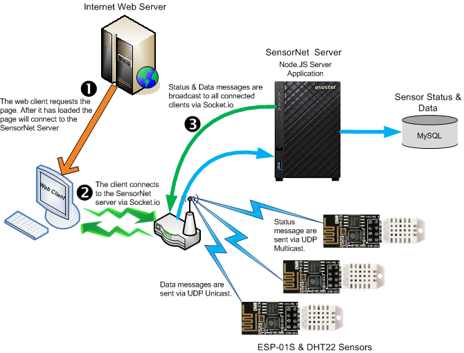
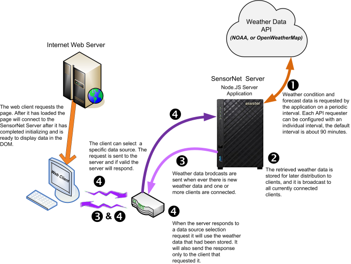

# sensornet

SensorNet - An IoT project that connects ESP8266 based sensors through a NodeJS server which forwards sensor data to a database. The web client received notifications when sensor status or data is updated.

## Submodules

This project currently consists of 3 submodules - 

* Sensors - [esp8266-dht-udp](<https://github.com/jxmot/esp8266-dht-udp>)
* A NodeJS server - [node-dht-udp](<https://github.com/jxmot/node-dht-udp>)
* Client - [client-dht-udp](<https://github.com/jxmot/client-dht-udp>)

Each module repository contains a README. Please note that this project including its submodules is a *work in progress* and is subject to changes and additions.

**NOTE:** The links above point to the original submodule repositories. They *may* be _**newer**_ than what is contained to within this repository. I will update this repository with the submodules changes when they hit milestones.

## Overview

I had been tinkering with using an ESP8266 and a temperature/humidity sensor to record environmental data within my home. I hadn't really moved forward with it until near the end of December 2017. And what really prompted me to move forward with the project was the brutally cold temperatures we experienced in Chicago. I was concerned about my home's water pipes freezing, or my furnace breaking down. So the completion of this project (_sensors, server, database, and web client_) became **very** important. Fortunately no pipes froze, and my furnace continued working! I was luckier than some of my neighbors!

### Components & Technologies :

*   **Sensor Devices :**
    *   ESP-01S
    *   DHT22/BSS138 - The use of a BSS138 based bidirectional level converter and proved to be an solution in preventing data-read errors.
    *   WiFi/UDP - The sensor devices communicate a JSON packet via UDP over WiFi to the server. Status messages are broadcast and data messages are targeted at the server. The status message broadcast will allow future devices on the network to monitor and manage the status of the sensor devices.

*   **Server :**
    *   Node.js
    *   UDP
    *   Socket.io
    *   MySQL Database - The Node.js application listens for UDP packets from the sensors. Before writing the contents to the database a _time stamp_ is added to the packet. The time stamp is stored as an _epoch_ value and used as an index. After a new row (_status or data_) has been written to the database the contents are broadcast to all connected web clients via Socket.io.

*   **Web Clients :**
    *   HTML/CSS
    *   JavaScript/JQuery
    *   Socket.io
    *   C3.js - A D3.js based chart library used in creating the gauges

### Features :

*   **Data Management** - The total number of rows in the status and data tables is managed. This was one my requirements to keep the tables from growing to an unmanageable size. This feature is implemented as a configurable timer that removes rows based on a configurable _age_.
*   **Configurable** - The sensor devices, server, and clients are configurable in a number of aspects. For example, the sensor devices can have their reporting interval configured and the server is configurable in regards to its network connection and database type. Please see the submodule README for additional details.
*   **Server Run-Time Event Logging** - The server uses a log file module to record internal events to a text file where each event is time stamped. Configuration settings can be used to manage the log file name & extenstion, maximum file size, and other aspects.
*   **Sensor Device Error Detection & Automatic Recovery** - The sensor devices can detect start up and run time errors and report them via UDP multi-cast. And if possible the devices can attempt to recover from some errors. All status messages are broadcast by the sensors and saved in the database by the server, and forwarded to the clients.
*   **Automatic Server Discovery by Sensors** - When a sensor completes boot-up and initialization it sends a UDP multi-cast message that is interpreted by the Server to be a query for its IP address, and the server will respond with a message containing its IP address. The sensor will send data to that IP address when updates occur.
*   **Low Impact use of Third Party APIs(_weather data_)** - Third party APIs are used to obtain the weather observation and forecast data. The weather data is requested by the server and not by the clients. It temporarily saves the weather data and retransmits it to clients as needed.
*   **Immediate Client Updates** - Web clients receive updates via Socket.io. The status and data updates are broadcast to all clients, and are received nearly immediately. Since the updates are transmitted when the database is updated there was an issue where clients would have to wait for the next update of sensor before it could be displayed. The work-around was to modify the server to _remember_ the last update for the sensors and then transmit their status & data directly to the client when it connects.
*   **Low Cost of Implementation** - I was able to keep the cost of the sensor devices under $20. You might be able to get the cost even lower if the parts are sourced overseas. Additional costs are the SensorNet Server platform and hosting for the SensorNet application web page. My SensorNet server is running on a NAS that runs linux and Node.js. It also contains the MySQL database used for storing sensor activity. The application page could be hosted on the same NAS because it also runs Apache. But I chose to use a hosting service instead. 

## Architecture Overview

### Sensor Data & Status Handling

Here is a high level diagram of the SensorNet system :

  

### Weather Data Handling

  

